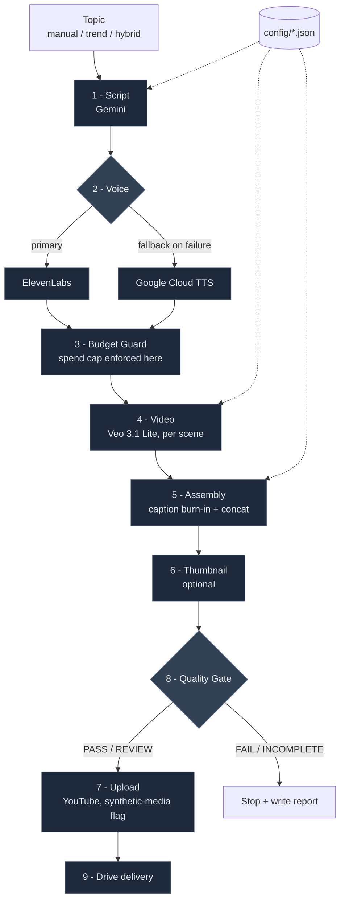

# Faceless YouTube Shorts Pipeline

An automated, faceless YouTube Shorts generator for an **AI/Tech × Psychology** niche channel. It takes a topic (or picks a trending one), writes a retention-optimized script, narrates it, generates per-scene video, burns in captions, runs a quality gate, and optionally uploads to YouTube — end to end, unattended.

The pipeline runs locally as a CLI or as a containerized **Google Cloud Run** job.

> **Note on cost:** this project calls paid Google Cloud APIs (Veo video, Gemini, Cloud TTS) and, optionally, ElevenLabs. Video generation (Veo) dominates the per-video cost. A budget guard blocks paid work once a configurable threshold is reached.

---

## Features

- **Story-first scripting** — Gemini generates short-form "emotional micro-fiction" scripts built around a named psychological phenomenon, with a triple-hook structure and loop engineering for replays.
- **Voice with word-level timing** — ElevenLabs primary, **automatic fallback to Google Cloud TTS** if ElevenLabs fails. Both paths produce per-word timestamps used for caption sync and scene cuts.
- **Per-scene video** — Veo 3.1 Lite clips, one per scene, with per-scene color moods and enforced visual variety.
- **Caption burn-in & assembly** — FFmpeg-based, word-timed captions over concatenated clips.
- **Budget guard** — hard spend cap enforced *before* the first paid video call.
- **Quality gate** — every run ends with a `PASS` / `REVIEW` / `FAIL` / `INCOMPLETE` verdict and a JSON report.
- **YouTube upload** — marks content as synthetic media (`status.containsSyntheticMedia=true`).
- **Config-driven** — channel identity, style, pricing, and pipeline behavior all live in `config/*.json`, not source.

---

## Architecture



Both voice paths produce per-word timestamps used for caption sync and scene cuts. The budget guard sits **before** the first paid video call, so an over-threshold run stops without spending on Veo.

Pipeline stages (`src/`):

| Stage | Module | Purpose |
| --- | --- | --- |
| 1 | `module1_script.py` | Script generation (see also `agents/script_writer.py`) |
| 2 | `module2_voice.py` | TTS + per-word SSML `<mark>` timing (ElevenLabs → Google TTS fallback) |
| 3 | `module3_budget_guard.py` | Spend cap, enforced before paid media calls |
| 4 | `module4_video.py` | Veo 3.1 Lite clip generation |
| 5 | `module5_assembly.py` | Caption burn-in + final assembly |
| 6 | `module6_thumbnail.py` | Thumbnail (optional) |
| 7 | `module7_uploader.py` | YouTube upload |
| 8 | `module8_quality_gate.py` | Verdict + quality report |
| 9 | `module9_drive.py` | Google Drive delivery |

Creative agents live in `src/agents/` (creative director, scene planner, retention director, trend scorer, storyboard generator, prompt linter, and the script writer). The orchestrator (`src/orchestrator.py`) wires it all together.

---

## Requirements

- **Python 3.11+**
- **FFmpeg + ffprobe** on `PATH`
- **Google Cloud project** with these APIs enabled: Vertex AI (Gemini + Veo), Cloud Text-to-Speech
- Credentials:
  - Application Default Credentials for Gemini / Veo / Cloud TTS: `gcloud auth application-default login`
  - *(Optional)* `ELEVENLABS_API_KEY` + `ELEVENLABS_VOICE_ID` for primary voice — omit to use Google TTS directly
  - *(Optional)* YouTube OAuth token for uploads

---

## Setup

```bash
git clone <your-fork-url>
cd Youtube

python -m venv .venv
# Windows
.venv\Scripts\activate
# macOS / Linux
source .venv/bin/activate

pip install -r requirements.txt
```

Copy `.env.example` to `.env` and fill in your values:

```bash
GOOGLE_CLOUD_PROJECT=your-project-id
VERTEX_LOCATION=us-central1
GOOGLE_APPLICATION_CREDENTIALS=/path/to/service-account.json   # optional if using ADC
```

Voice env vars (optional — Google TTS is the fallback if unset or on failure):

```bash
ELEVENLABS_API_KEY=...
ELEVENLABS_VOICE_ID=...
GOOGLE_TTS_VOICE=en-US-Neural2-F   # overrides config default
```

---

## Usage

Mock run — no paid APIs, uses FFmpeg placeholders (good for testing structure and the quality gate):

```bash
python main.py --mock --skip-upload
```

Dry run — runs the creative agents but skips expensive media APIs (TTS / Veo):

```bash
python main.py --dry-run
```

Real run, no upload — generates a full video but does not publish:

```bash
python main.py --skip-upload
```

Real run with upload — privacy set in `config/pipeline_config.json`:

```bash
python main.py
```

Pick the topic yourself instead of trend selection:

```bash
python main.py --topic "Why AI chatbots feel like friends" --skip-upload
```

### CLI flags

| Flag | Description |
| --- | --- |
| `--topic "..."` | Specific topic; if set, mode switches to `manual` |
| `--mode {manual,trend,hybrid}` | Topic selection strategy (default: `trend`) |
| `--mock` | No paid API calls; FFmpeg placeholders |
| `--dry-run` | Run agents, skip TTS/Veo |
| `--skip-upload` | Skip YouTube upload |
| `--deterministic` | Temperature 0 for reproducible LLM output |
| `--simulate-timeout` / `--simulate-budget-breach` / `--simulate-interrupt` | Force failure paths for quality-gate testing |

### Output

Each run writes artifacts under `output/<run_id>/`:

- `script.json`
- `narration.mp3`, `word_timings.json`
- `clips/scene_XX.mp4`
- `assembly/final_short.mp4`
- `verification/caption_check.jpg`
- `quality_report.json`

The cumulative spend counter lives at `data/budget_counter.json`.

---

## Configuration

All behavior is driven by JSON in `config/`:

| File | Controls |
| --- | --- |
| `channel_identity.json` | Niche, persona, tone, audience, content rules |
| `pipeline_config.json` | Scene count, clip duration, **resolution**, budget threshold, upload privacy, TTS voice |
| `pricing_verified.json` | Model IDs and unit costs (verified at build time) |
| `style_guide.json`, `character_bible.json`, `motion_rules.json`, `rhythm_templates.json`, `visual_diversity_rules.json` | Visual and pacing rules |

### Cost knobs worth knowing

Veo is billed per generated second and is ~95% of per-video cost. Resolution is the biggest lever:

| Resolution | Veo rate | ~24s video (4 scenes) | ~30s video (5 scenes) |
| --- | --- | --- | --- |
| **720p** (default) | $0.05/s | ~$1.20 | ~$1.50 |
| 1080p | $0.08/s | ~$1.92 | ~$2.40 |

Set `video_resolution` in `config/pipeline_config.json`. Re-verify current API pricing with:

```bash
python scripts/verify_pricing.py
```

---

## Deployment (Google Cloud Run)

The pipeline can run as a Cloud Run **job**. `deploy.sh` builds the container via Cloud Build and updates the job:

```bash
bash deploy.sh
```

Then execute a run:

```bash
gcloud run jobs execute shorts-pipeline --region us-central1
```

Adjust the project ID, region, and job name in `deploy.sh` / `cloudbuild.yaml` for your own environment.

---

## Project layout

```
main.py                 # CLI entry point
deploy.sh               # Cloud Build + Cloud Run job deploy
cloudbuild.yaml         # Container build config
config/                 # All JSON configuration
src/
  orchestrator.py       # Pipeline wiring
  module1..9_*.py        # Pipeline stages
  agents/               # Creative agents (script writer, planners, scorers)
  builders/             # Visual prompt builder
  utils/                # Shared helpers
scripts/verify_pricing.py
```

---

## Contributing

Contributions are welcome. Please:

1. Open an issue describing the change before large PRs.
2. Keep configuration in `config/*.json` rather than hardcoding.
3. Test with `--mock` runs where possible to avoid paid API calls in CI.

---

## Disclaimer

This tool generates AI content and uploads it flagged as synthetic media. You are responsible for complying with YouTube's policies, the terms of every API you use, and applicable law in your jurisdiction. API usage incurs real costs — set your budget threshold accordingly.

## License

Released under the [MIT License](LICENSE). Copyright (c) 2026 Nickhasntlost.
